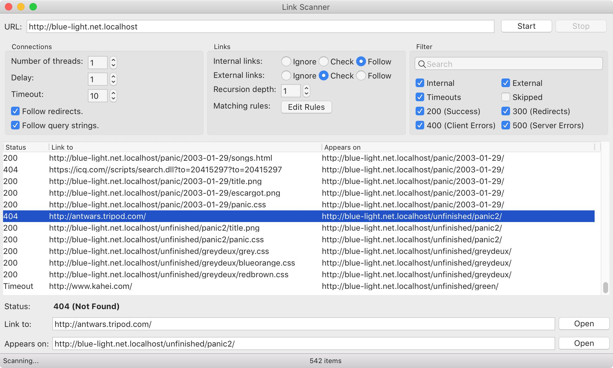
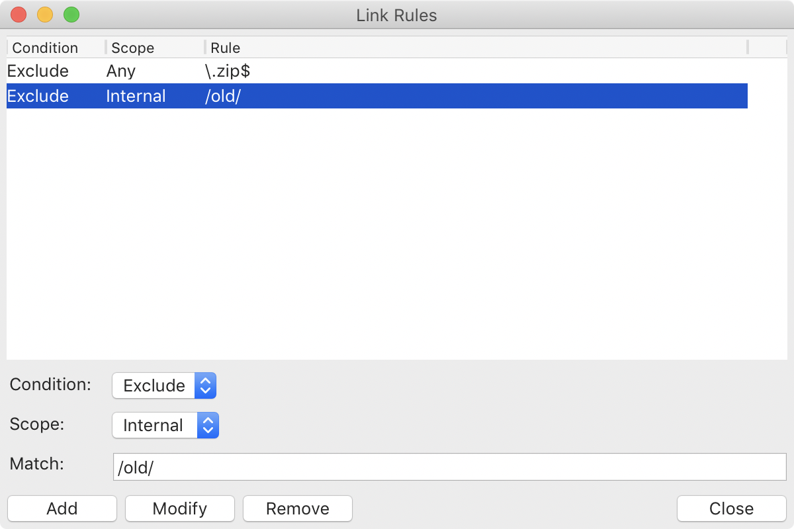

# link-scanner

A utility to check for broken links on web pages or web sites. Written in Python 3 using the wxWidgets GUI toolkit.

It requires the following non-core modules to be installed:

- [wxPython](https://pypi.org/project/wxPython/)
- [beautifulsoup4](https://pypi.org/project/beautifulsoup4/)
- [requests](https://pypi.org/project/requests/)

## Installation

Install Python 3 on your computer using one of the [official installers](https://www.python.org/downloads/) or using a package manager such as [MacPorts](https://www.macports.org/). On Windows, the installer gives you the option to add Python to your PATH, which I recommend selecting since it makes it easier to run Python from the command line.

Then [download the files](https://github.com/jcfieldsdev/link-scanner/archive/refs/heads/master.zip) from this repository and extract them somewhere. Open a Command Prompt or Terminal window to this directory and enter the following:

    pip install -r requirements.txt

This automatically installs the required dependencies for the program. If you get an error that PIP is not installed, you can install it manually by downloading and running [this script](https://bootstrap.pypa.io/get-pip.py). Then repeat the above command.

Then you can run the program by double-clicking the .py file icon in the file manager or with the following command:

    python scanner.py

## Guide

### Scanner Window

There are four main parts to the Link Scanner window: the URL field, the options, the requests list, and the link information area.

#### URL field

Input a starting URL in the URL field. The URL must be a valid web site using the `http` or `https` scheme.

Click the "Start" button at any point to start scanning links or the "Stop" button to stop a scan. The "Start" button becomes a "Pause" button while scanning to momentarily pause a scan in progress.

#### Options

Options that are changed while a scan is ongoing do not take effect until the scan is stopped and restarted.

##### Connections

*Number of threads* specifies how many simultaneous connections to make. More threads return results faster but may overly saturate the network connection. Be careful accessing external links with multiple threads, as many servers block clients who make too many simultaneous connections.

*Delay* adds specifies how long in seconds to wait between each request. Some servers ban clients that make requests too frequently.

*Timeout* specifies how long in seconds to wait for a web server to respond before giving up.

*Follow redirects* tells the scanner to follow any HTTP redirects if encountered. *Follow query strings* follows URLs with [query string](https://en.wikipedia.org/wiki/Query_string) parameters.

##### Links

*Internal links* and *External links* define the behavior for scanning internal links and external links respectively:

- "Ignore" skips any such links.
- "Check" checks for the existence of a link and returns its status code.
- "Follow" checks for the existence of a link in addition to scanning it for additional links if it points to an HTML page.

Note that internal links that redirect to external links are recognized as internal links by these settings.

*Recursion depth* specifies how many pages deep the scanner traverses for external links. It doesn't affect internal links, which always have infinite recursion depth if set to "Follow."

Clicking the "Edit Rules" buttons opens a window for editing rules for filtering links. An overview of this window is in a separate section below.

##### Filter

The filter options determine which links are shown in the requests list and allows you to filter responses by origin (internal or external, relative to the starting URL) or by HTTP status code.

There is also a search field at the top of this category that filters the list by matching a substring in either the "Link to" or "Appears on" column.

#### Requests list

The requests list shows the results of scanned links. Note that links are added to the requests list as server responses are received, which is not always the order in which the requests were made.

- *Status* shows the HTTP status code of the response, "Timeout" if the server could not be reached or did not respond, or "Skipped" if the link was skipped because of a user preference.
- *Link to* shows the URL of the link.
- *Appears on* shows the URL of the page on which the link appears.

#### Link information

The link information area presents the same information available in the requests list but in a wider form and with text fields that can be copied. The "Open" buttons open the adjacent URL in a web browser.

### Rules Editor

The rules editor lets you specify matching rules for links using [regular expressions](https://en.wikipedia.org/wiki/Regular_expression). The window shows a list of any rules that may already exist.

You can add a new rule or edit an existing one in the area below:

- *Condition* defines how the rule is enforced. "Include" means that all links must match the rule to be included. "Exclude" means that any links matching the link are excluded.
- *Scope* specifies whether the rule applies to internal links, external links, or both.
- *Match* is a regular expression against which every link in the selected scope is compared.

Click the "Add" button to add a new rule. If an existing rule is selected, you can use the "Modify" button to change it or the "Remove" button to remove it.

Rules are compared against the full URL, not the text as written in the HTML. If the link is a redirect, the rule is compared against the original URL.

Options and rules are saved in a configuration file if the program is exited cleanly.

## Acknowledgments

Based on [404](https://github.com/Beluki/404) by [Beluki](https://github.com/Beluki).

Uses [radar graphic](https://commons.wikimedia.org/wiki/File:Radar_Graphic.svg) by [CommanderOzEvolved](https://commons.wikimedia.org/wiki/User:CommanderOzEvolved).

## Authors

- J.C. Fields <jcfields@jcfields.dev>

## License

- [MIT license](https://opensource.org/licenses/mit-license.php)
